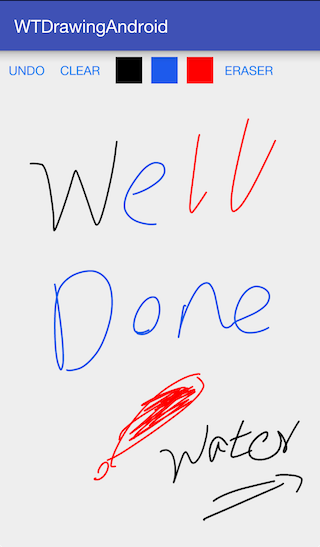

# WTDrawingAndroid
A simple way to draw smooth line on Android.
## Screenshot

## Features
* Change stroke color
* Change stroke width
* Undo
* Clear all drawings
* Eraser drawing

## Usage
In Android Studio, just import module `wtdrawing`. In other IDE, you should copy `WTBezierPath.java` and `WTDrawingView.java` into your project.
### Init in layout
~~~xml
<com.water.wtdrawing.WTDrawingView
       android:id="@+id/wtDrawingView"
       android:layout_width="match_parent"
       android:layout_height="match_parent"/>
~~~
**Note:** `layout_width` and `layout_height` can not be `wrap_content`.
### Init with Java code
~~~java
int width = width you want;
int height = height you want;
WTDrawingView wtDrawingView = new WTDrawingView(context,width,height);
~~~
Then add WTDrawingView instance to your view group.
### Undo
~~~java
wtDrawingView.undo();
~~~
### Clear all drawings
~~~java
wtDrawingView.clear();
~~~
### Draw eraser
~~~java
wtDrawingView.setEraserMode(true);
~~~
### Change stroke width
Default stroke width is 2.0(dp).

~~~java
wtDrawingView.setStrokeWidth(5.0f); // 5.0f is a dp value.
~~~
### Change stroke color
Default stroke color is black.

~~~java
wtDrawingView.setStrokeColor(Color.RED);
~~~
### Change eraser stroke width
Default eraser width is 20(dp).

~~~java
wtDrawingView.setEraserWidth(20.0f); // 20.0f is a dp value.
~~~